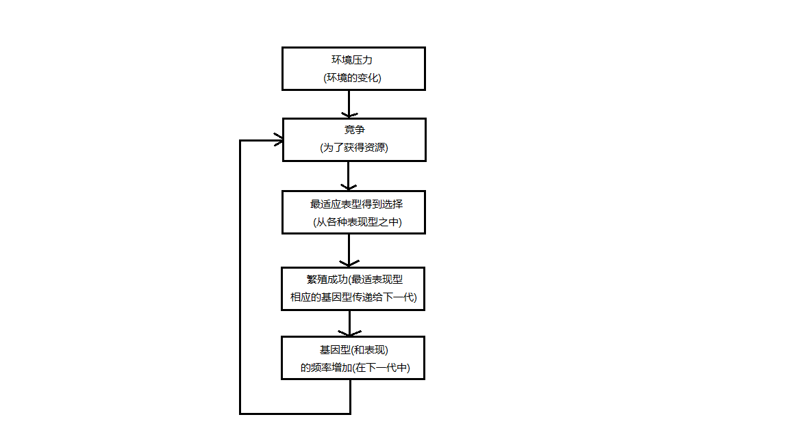

# 遗传和行为  
+ 进化与自然选择  
    动物种类的变异是自然过程作用的结果，这个过程称为自然选择。  
    自然选择的理论认为，生物机体适应生存环境，只要这种适应性变异发生了，就会比那些适应性差的个体产生更多后代。久而久之，那些具有适应特征的有机体的数量就会比不具有这些特征的有机体多。用进化论的术语来说，个体的成功与否取决与其后代的数量。 

+ 基因型和表型  
   

+ 人类的进化
    在人类进化中，自然选择促进了两大适应性进化：
    + 两足化：直立行走的能力
    + 大脑化：脑容量增大

    两足化和大脑化之后，最重要的人类进化里程碑：语言的出现。  
    语言是文化进化的基础，而文化进化是通过学习来适应性地应对环境变换的文化趋势。文化进化引起工具制造的重大发展、农业设施的改善以及工业和技术的发展与进步。文化进化还使人类能很快调整并适应环境条件的变化

## 人类基因型的变异  
### 基础遗传学
&nbsp;&nbsp;&nbsp;&nbsp;基因调节身体的生理过程和表型性状的表达(身体构建、体力、智力和许多行为模式)
  + 遗传学：研究遗传(heredity)机制的学科，即个体从其祖先继承生理和心里特质
  + 性染色体：决定男性或女性生理特征的基因
  + 多基因性状：一些特征是由不止一对基因来决定的。
  + 基因组：染色体上基因以及相关DNA的全部序列
  
### 基因和行为
&nbsp;&nbsp;&nbsp;&nbsp;进化过程已经使得人类基因型存在相当多的变异，基因型与特殊环境的相互作用产生了人类表型的变异。
  + 人类行为遗传学(human behavior genetics)：把心理学和遗传学结合起来，探索遗传和行为之间的因果关系，关注于个体差异的根源
  + 社会生物学(sociobiology)：为社会行为以及人类和其他动物的社会系统提供了进化论的解释
  + 进化心理学(evolutionary psychology)：将这种进化的解释扩展到人类经验的其他方面。

# 神经系统的活动
## 神经元  
  专业名词： 
  + 神经元(neuron)：能接收、加工或传递信息到体内其它细胞的细胞，神经元一般只沿一个方向传递信息(树突——>胞体——>轴突——>终扣)。
  + 树突(dentrites)：接受从感受器或其他神经元发出的刺激。
  + 胞体(soma)：神经元的细胞体，整合从树突接收的刺激。
  + 轴突(axon)：自神经元发起的一条突起。
  + 终扣(terminal buttons)：轴突的末端的一个膨大的球状结构。
  + 感觉神经元(sensory neurons)：高度特化的细胞，对光线、声音和身体位置非   常敏感，携带来自感受器细胞的信息向内传至中枢神经系统
  + 运动神经元(motor neurons)：携带来自中枢神经系统的信息向外传至肌肉和腺体。
  + 中间神经元(internerurons)：从神经元将信息传递到其他中间神经元或运动神经元。
  + 胶质细胞(glia)：散布于大脑庞大的神经元网络之间的细胞，可达神经元5-10倍之多。主要功能  
    + 保持神经元的位置：帮助新生的神经元找到其在脑内的适当位置。
    + 清理脑内环境：当神经元受损或死亡，附近的胶质细胞就会增生，以清除受损或死亡神经元留下的废物，还能吸收过量的神经递质和神经元间隙的其他物质。
    + 绝缘：胶质细胞在某类轴突的周围形成一层绝缘的外鞘，称为髓鞘(myelin sheath)。这种脂肪性绝缘大大增加了神经信号的传递速度。
    + 防止有害物质达到大脑的精密细胞。  

## 动作电位  
  ### 动作电位的产生
    每个神经元将接收到兴奋性输入(excitatory inputs)和抑制性输入(inhibitory inputs)的平衡，前者表达为发放，后者表达为不发放。在神经元内，兴奋性输入在一定时间和空间范围内的正确模式，将导致动作电位的产生，即神经元的发放。

  ### 动作电位的生物化学基础
        所有神经传导都必须通过称为离子的带电粒子穿过细胞膜的流动产生。细胞膜将细胞内外环境分隔开来的薄膜。神经元内外的液体都含有各种离子：钠离子(Na+)、氯离子(Cl-)、钙离子(Ca2+)和钾离子(K+)，它们带有正电荷或负电荷。细胞膜在维持两种液体成分的适当平衡上具有关键作用。  
        当细胞不活动或处于静息电位，细胞内钾离子的浓度更高，而细胞外钠离子浓度更高。细胞并不是完美的屏障，它有很小的渗孔，使钠离子可以渗入同时钾离子渗出。为了调整这种情况，细胞膜还有转运机制，可以将钾离子泵入和将钠离子泵出。这些离子泵的成功转运使细胞内液相对细胞外液具有70毫伏的负电压。这就意味着相对与细胞外液而言，细胞内液发生了极化。这一轻微的极化电位称为静息电位(resting potential)，它提供了神经细胞产生动作电位的电位学环境。

  ### 动作电位的性质
  + 动作电位遵从全或无定律(all-or-none las)：动作电位的大小不受阈

## 突出传递  

## 神经递质及其功能

# 生活中的批判性思维：“这是遗传的”是什么意思

# 生物学和行为  

## 对脑的窃听  

## 神经系统  

## 脑结构及其功能  

## 半球功能偏侧化  

## 内分泌系统  

## 可塑性和神经发生：变化的大脑

# 生活中的心理学：你的大脑如何确定信任与否
